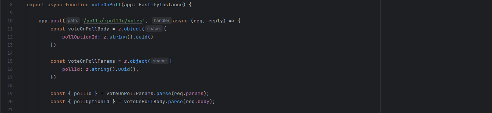

<h1 align="center">
    
</h1>

## 💻 Sobre a aplicação
API de enquetes criada durante a NLW utilizando conceitos de API REST, TypeScript, Fastify como framework, integração do 
Prisma ORM, Docker para lidar com serviços de PostgreSQL e Redis, Zod para validação de dados e WebSocket para 
comunicação real-time.

## 🛠 Tecnologias

As seguintes ferramentas foram usadas na construção do projeto:

- Node
- TypeScript
- Fastify
- Docker
- Prisma
- PostgreSQL
- Redis
- WebSocket

